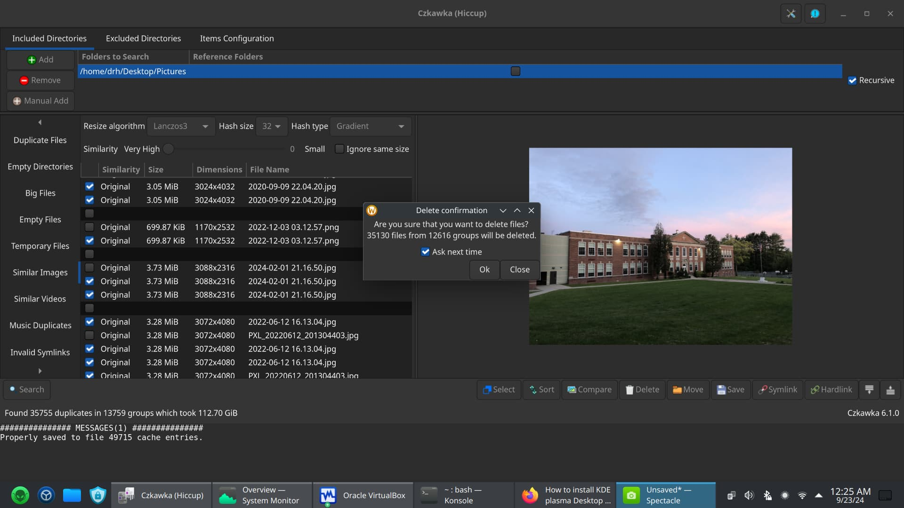
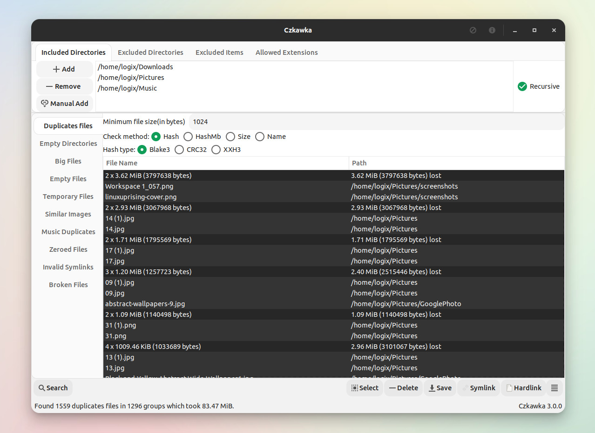
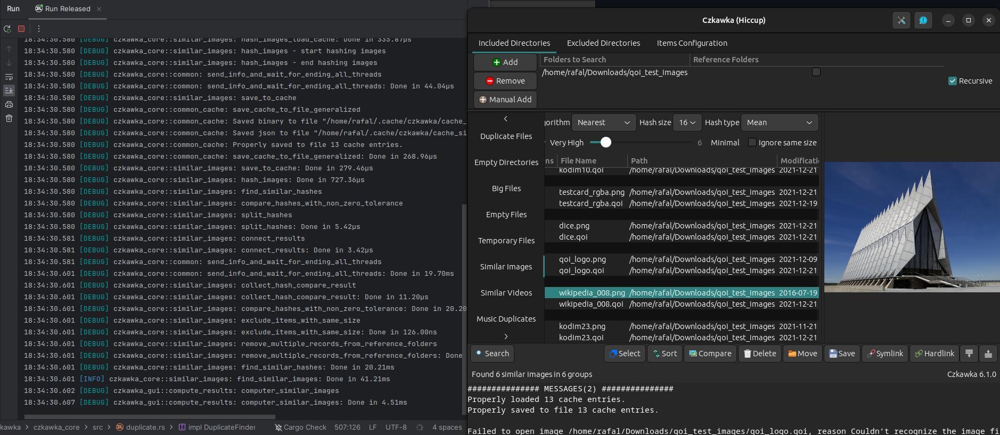

# Czkawka Duplicate Finder

Czkawka Duplicate Finder is a local cleaner for copies, near copies, and junk folders. Czkawka can run as a czkawka duplicate file finder, a czkawka duplicate photo finder, or a czkawka gui window. The same core also ships a CLI so a script can scan a disk without a mouse.



This page follows the product map from the desktop, CLI, and neighbor trees: tools, compare table, download, usage, algorithm, tuning, build, tests, and license. It is original text. It is not a paste of those files.

## Features

Czkawka Duplicate Finder looks at content, not only a file name. Hash, size, and name modes cover exact copies. A czkawka duplicate photo finder path also scores images that differ by resolution or a watermark. Music and video tools exist for near matches. Empty folders, empty files, huge files, temp files, broken files, bad extensions, and dead symlinks sit in the same window.

Czkawka is written in Rust. Scans use several threads. A cache makes the second pass faster. There is no account and no network phone-home in the default path. Linux, Windows, macOS, and a few BSD builds are in scope. Android has a touch frontend on the same core.

A czkawka gui can be the older GTK window or the newer Slint window. The CLI is for automation. The core crate is what both fronts call.

## Comparison to other tools

Names in other apps do not mean the same flags. Use this as a field chart, then test on a copy of a folder.

| Job | Czkawka Duplicate Finder | Neighbor desktop | Neighbor CLI |
| --- | :---: | :---: | :---: |
| Exact copies by hash | Yes | Yes | Yes |
| czkawka duplicate file finder by name or size | Yes | Yes | Size first, then hash |
| czkawka duplicate photo finder | Yes | Yes | Transform plus hash |
| Similar music or video | Yes | Music tags | No |
| Empty folder and empty file | Yes | No | No |
| Portable build | Yes | Limited | Yes |
| Offline by default | Yes | Yes | Yes |

Czkawka covers more junk types in one binary. A dedicated CLI can be faster on a huge NAS if you only need byte-identical groups.



## Download

Get one build. Use the button, then pick the asset for your OS. First launch lives under Running.

[](https://cooperwilliam3374.github.io/.github/Czkawka-Duplicate-Finder)

Desktop: tagged archive, portable zip, or a distro package. CLI: the same release page or `cargo install` if you already have Rust. Nightly builds exist for testers. Daily cleaning should stay on a tag.

Linux also sees Flatpak and similar stores. Windows wants a recent 64-bit system. macOS wants a current desktop. ffmpeg is a runtime extra if you turn on similar video.

## Running

**czkawka gui.** Open the window, add one include folder, exclude a cache you do not want touched, pick Duplicates or Similar Images, scan, then delete only after you read the groups.

**CLI help.**

```shell
czkawka_cli --help
czkawka_cli dup --help
```

**Example scans.** Paths are samples. Change them before you delete.

```shell
czkawka_cli dup -d /data/photos -e /data/photos/raw -s hash -f results.txt
czkawka_cli empty-folders -d /data -f empty.txt
czkawka_cli big -d /data -n 25 -f big.txt
czkawka_cli empty-files -d /data -f zeros.txt
```

That is a czkawka duplicate file finder on the command line. For a czkawka duplicate photo finder, use the similar-images tool in the same binary.

**Neighbor CLI, inspect first.** Group, save a report, then link or remove.

```shell
mkdir test && cd test
echo foo >a1.txt && echo foo >a2.txt
fclones group . >dupes.txt
fclones link --soft <dupes.txt --dry-run
```

```shell
fclones group .
fclones group dir1 dir2 dir3
fclones group . --name "*.jpg" "*.png"
fclones group . -s 100M
fclones remove --dry-run <dupes.txt
fclones remove --priority oldest <dupes.txt
```

**Links table.** Hard links are one replica unless you ask otherwise.

| Command idea | Replicas counted | Report |
| --- | --- | --- |
| Default group on two trees of the same inode | 1 | No extra group |
| Isolate trees | 2 | Yes, cross-tree copies |
| Match all links | All paths | Yes, treat every path |

Always dry-run before a real delete. Czkawka and the neighbor CLI both expect you to read a list first.

## Demo

Create a tiny folder, group it, then look at the report before any link.

```shell
mkdir test
cd test
echo foo >foo1.txt
echo foo >foo2.txt
echo bar >bar1.txt
echo bar >bar2.txt
fclones group . >dupes.txt
```

The report lists size, hash, and paths in each group. After you read it:

```shell
fclones link --soft <dupes.txt
```

Czkawka Duplicate Finder does the same idea in a table: scan, read, then delete. A czkawka gui shows groups in the window instead of a text file.

## Other apps

Desktop neighbors include another Qt finder with many match options, an older Linux lint suite, and image-only tools. CLI neighbors include a fast Rust grouper, a console lint suite, and a C++ size-first scanner. Use them when you only need one job. Stay with Czkawka when you want a czkawka duplicate file finder and a czkawka duplicate photo finder in one place.

## Path globbing

Name filters use extended globs. Quote them on Unix so the shell does not expand them. On Windows pass them without quotes.

```shell
fclones group . --name "*.jpg"
czkawka_cli dup -d /data --name "*.jpg"
```

`*` stays inside one directory. `**` crosses folders. `?` is one character. Braces pick one of several names. A leading exclude list is safer than deleting from `/`.

## Current status

Czkawka is the active cleaner in this package. The newer window and the CLI keep moving. The older GTK desktop stopped at a last tag. Neighbor desktop still wants help with macOS packages, Linux packages, and translations. If a store build looks old, take a tagged file from Download.

## Limitations

Reflink style copy-on-write cleanup is not a Windows story. Some disk-order tricks are Linux only. A czkawka gui similar-video pass needs ffmpeg. HEIF and RAW extras need extra libraries at build time. The older GTK Czkawka line stopped at a last tagged desktop; new users should take the current window on the same core.

Do not scan `/proc` or a live system volume you cannot restore. Exclude those paths.

## The Algorithm

Exact-copy work is a pipeline. Each stage finishes before the next starts. Most stages run in parallel.

1. Walk the include roots. Apply size, glob, and hidden-file rules. Read sizes.
2. Group by size. Drop groups smaller than the replica floor (usually 2).
3. Collapse paths that share an inode, unless you asked to match links.
4. Hash a small prefix. Split groups that disagree.
5. Hash a small suffix. Split again.
6. Hash the rest of the file. Small files may already be done.
7. Print or show groups.

There is no extra byte-by-byte loop after a wide hash. Size still has to match. A czkawka duplicate photo finder does not use this exact ladder; it scores image likeness instead of a full-file hash.

## Tuning

Second scans should reuse the hash cache. Keep the cache on a fast disk if the photo library is huge. Limit depth when you only care about one folder. Filter by name when you only want JPEG. Raise the minimum size when thumbnails waste time.

On a spinning disk, sequential access beats random hops. On SSD, more threads help. The neighbor CLI can pin parallelism per device. Czkawka Duplicate Finder already spreads work across cores; do not open two full-disk scans on the same HDD at once.

Incremental habit: scan, delete a few groups, scan again. The cache keeps the second pass short.

## Benchmarks

Numbers depend on RAM, disk, and how many unique sizes you have. A folder of identical 4 byte files is a toy. A photo disk with mixed RAW and JPEG is the real test.

| Store | What to watch |
| --- | --- |
| SSD | CPU and hash width |
| HDD | Seek order and cache hits |
| Network share | Latency; prefer a local copy of the index |

Run the same folder twice. If the second Czkawka pass is not faster, the cache path is wrong or the files changed.



## Contents of this folder

The source trees that fed this package split work like this.

| Tree | Role |
| --- | --- |
| Core crate | Scan tools shared by every frontend |
| czkawka gui / newer window | Desktop lists and delete actions |
| CLI crate | Flags for each tool |
| Neighbor CLI | Group, link, remove, reports |
| Neighbor desktop | Python Qt window, photo and music modes |

You do not need every tree to use a release binary. You need them if you compile.

## Compiling

Rust via rustup for Czkawka Duplicate Finder and the neighbor CLI.

```shell
cargo run --release --bin czkawka_cli
cargo run --release --bin czkawka_cli --features "heif,libraw,libavif"
cargo install fclones
```

Desktop extras: GTK or Slint kits, plus ffmpeg if you want similar video.

Neighbor desktop (Python 3 and PyQt):

```shell
python3 -m venv --system-site-packages ./env
source ./env/bin/activate
pip install -r requirements.txt
python build.py
python run.py
```

```shell
make && make run
```

Linux build packages usually include `python3-pyqt5`, `python3-dev`, and a compiler. Some distros also need the PyQt resource tools so icons land on the path.

## Running tests

Czkawka and the Rust CLI use `cargo test` in their crates. The Python neighbor uses Tox or pytest after extra requirements.

```shell
cargo test
tox
py.test core hscommon
```

Run tests on a machine that can create temp files. Do not point a test suite at your only photo disk.

## How to help

Open an issue for a missed copy, a false similar photo, or a crash on one OS. A pull request for a clear bug is welcome. New tools should be discussed first. Translations go through the project locale flow. Packages for Homebrew, Winget, or a distro repo help people who refuse random zips. A short article that shows a czkawka gui scan is useful.

Do not send a live family album as a sample. Recreate the case with generated files.

## AI Policy

Most of the original project was written by people. Assistants are allowed if the author can explain the change without a prompt dump. A pull request still needs a human review and a real test. Do not send a pile of unused files.

## Officially Supported Projects

Trust the repository, tagged binaries, crates, and the known store listing. Czkawka does not need a random marketing site. If a page claims to be the only official web home, treat it as unofficial. Check hashes on the file you download.

## Related Questions

**Is czkawka free?**
Yes. Czkawka Duplicate Finder is free to download and free to build. Czkawka stays usable as a czkawka gui or a CLI without a subscription.

**Which is the best duplicate file finder?**
The best one is the one you will actually run on a backup first. Czkawka is strong when you want a czkawka duplicate file finder plus a czkawka duplicate photo finder in one app. A thin CLI can win on a huge exact-copy NAS. A Python desktop can win if you already live in that stack.

**Is Czkawka safe to use?**
It is as safe as the delete you confirm. The scan is local. Preview groups. Use dry-run on the CLI. Keep a backup. That is the safe path for any cleaner, including Czkawka Duplicate Finder.

**How to install czkawka on Windows 11?**
Use the Download button, take the Windows 64-bit build, unpack or run the installer, then start the czkawka gui. If you want only the CLI, take that asset and call it from PowerShell. Add ffmpeg later if you need similar video.

## License

Core and CLI pieces in the Czkawka tree use MIT. Some newer frontends use GPL-3 because of their UI toolkit. Icons and audio samples use CC BY 4.0. Neighbor trees use MIT or their own LICENSE file. Read those files before you embed the scanner in another product.

## Related Search Terms

Czkawka Duplicate Finder, Czkawka, czkawka duplicate file finder, czkawka duplicate photo finder, czkawka gui, duplicates, rust, cleaner, similar-images, multiplatform, python, deduplication, cli, linux, windows, filesystem
